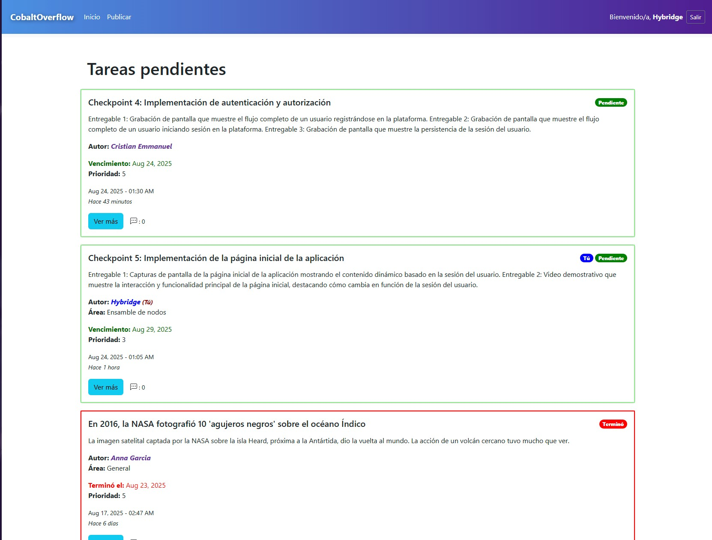

# Jack Cobalt Overflow

> Aplicación web de gestión de tareas, notas y eventos.



## Características Principales

* **Autenticación de Usuarios:** Registro e inicio de sesión.
* **Gestión de tareas y eventos:** Capacidad de gestionar tareas, eventos, notas, etc.
* **Función de temporizador:** El sistema hace evidente cuando una tarea es pendiente o ya ha terminado, según la fecha de expiración especificada.
* **Funcionalidades y estilo de red social:** Permite a los charlar entre sí a través de una caja de comentarios estilo chat, con un estilo moderno y sofisticado.

## Tecnologías Utilizadas

Este proyecto fue construido utilizando un stack tecnológico moderno y eficiente:

* **Backend:** Python, Flask
* **Base de Datos:** PostgreSQL (Supabase)
* **Frontend:** HTML, CSS
* **Framework de CSS:** Bootstrap
* **Librerías Python Clave:**
    * `Flask-SQLAlchemy`
    * `Flask-Login`
    * `Werkzeug`

## Instalación

Para ejecutar este proyecto en tu entorno local, sigue estos sencillos pasos:

**Pre-requisitos:**
* Python 3.8 o superior
* pip (gestor de paquetes de Python)

**Pasos:**

1.  **Clona el repositorio:**
    ```bash
    git clone [https://github.com/tu-usuario/tu-repositorio.git](https://github.com/tu-usuario/tu-repositorio.git)
    cd tu-repositorio
    ```

2.  **Crea y activa un entorno virtual:**
    ```bash
    # En Windows
    python -m venv venv
    .\venv\Scripts\activate

    # En macOS/Linux
    python3 -m venv venv
    source venv/bin/activate
    ```

3.  **Instala las dependencias:**
    El archivo `requirements.txt` contiene todas las librerías necesarias.
    ```bash
    pip install -r requirements.txt
    ```

4.  **Ejecuta la aplicación:**
    ```bash
    flask run
    ```
    (La aplicación estará disponible en `http://127.0.0.1:5000`)

## Autor

* **Cristian Mendoza**
* **GitHub:** [@cristianhybridge](https://github.com/cristianhybridge)
* **LinkedIn:** [Cristian Mendoza](https://www.linkedin.com/in/cristian-mendoza-56b860263)

---